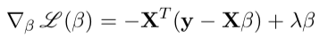

# Linear-Regression
Used gradient descent to fit regularized linear models with python

## Description
In this section, I fit three types of (regularized) linear models with gradient descent. 

* Linear Rrgression without regularization

Codes are in __class LinearRegression__. 

The MSE loss for linear regression is:

Although the optimized parameters can be calculated directly from normal equations, here we still use gradient descent to find the minumin loss:

* Linear Rregression with L2 (Ridge) regularization

Codes are in __class RidgeRegression__. 

The L2 loss for L2 regression is:

 
The gradient descent for L2 regression is:

* Logistic Regression without regularization

Codes are in __class LogisticRegression__. 

The log loss for logistic regression is:

The gradient descent for logistic regression is:

